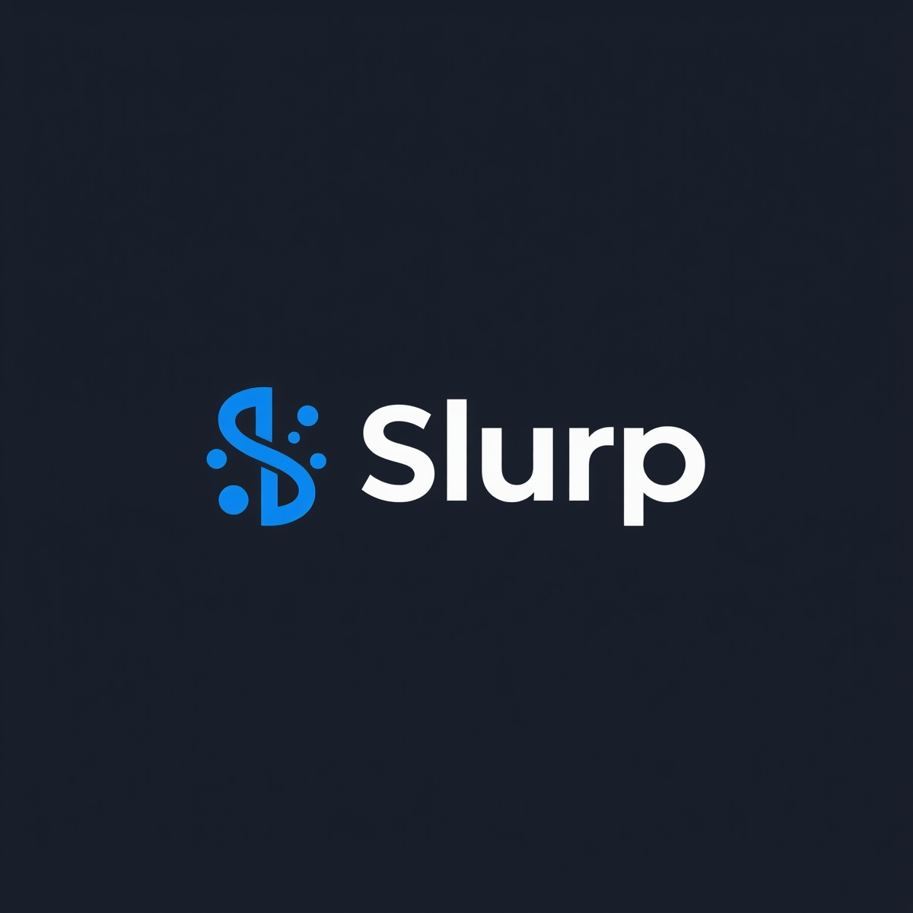

<div align="center">



# 🌊 Slurp

### Cross-Document RAG Dataset Generator

A comprehensive tool for generating RAG (Retrieval-Augmented Generation) datasets from Confluence pages (more sources planned).

[](https://github.com/4thel00z/slurp/actions)
[](https://github.com/4thel00z/slurp/actions)
[](https://www.python.org/downloads/)
[](https://github.com/astral-sh/ruff)

</div>

---
This system uses a distributed architecture with Kafka for task queue management, separate scraper and worker processes, and supports both batch and streaming processing.

## Architecture

- **Scraper**: Discovers and submits Confluence pages to a Kafka topic
- **Worker**: Processes pages from Kafka, generates QA pairs, and stores results in SQLite
- **Kafka/Redpanda**: Message queue for task distribution
- **SQLite**: Storage for processed documents and generated QA pairs

## Features

- **Distributed Processing**: Separate scraper and worker processes for scalability
- **Batch Processing**: Support for processing documents in batches for cross-document questions
- **Hierarchical Crawling**: Discovers parent-child relationships between pages
- **Date Filtering**: Filter pages by last modification date (e.g., only pages updated in last 6 months)
- **Intelligent Question Generation**: Creates questions of varying difficulty levels
- **Multiple Languages**: Support for German and English content
- **HTML Processing**: Robust HTML parsing for clean text extraction

## Installation

```bash
# Install core package (using uv)
uv sync

# Install with standalone script dependencies
uv sync --extra scripts

# Start Redpanda (Kafka-compatible message broker) for distributed mode
docker-compose up -d  # If you have a docker-compose.yml for Kafka/Redpanda
```

## Configuration

Set up your environment variables:

```bash
export CONFLUENCE_BASE_URL="https://your-domain.atlassian.net"
export CONFLUENCE_USERNAME="your-email@domain.com"
export CONFLUENCE_API_KEY="your-api-token"
export OPENROUTER_API_KEY="your-openrouter-key"
export KAFKA_BOOTSTRAP_SERVERS="localhost:19092"
export KAFKA_TOPIC="tasks"
export SQLITE_DATABASE="./data.db"
```

## Usage

### Distributed System (Production Mode)

#### Running the Scraper

The scraper discovers Confluence pages and submits them to Kafka:

```bash
# Scrape up to 50 pages from a Confluence space
python -m slurp scraper --confluence-space RESEARCH --confluence-max-pages 50

# Filter by recent pages (last 3 months)
python -m slurp scraper --confluence-space RESEARCH --confluence-months-back 3

# Skip the first 100 pages
python -m slurp scraper --confluence-space RESEARCH --confluence-skip 100

# Run multiple scraper workers
python -m slurp scraper --workers 2 --confluence-space RESEARCH
```

#### Running the Worker

The worker processes pages from Kafka and generates QA pairs:

```bash
# Process pages individually
python -m slurp worker --generator-batch-size 1

# Process pages in batches of 4 for cross-document questions
python -m slurp worker --generator-batch-size 4

# Specify a different model
python -m slurp worker --generator-model "anthropic/claude-3-sonnet"

# Run multiple worker processes
python -m slurp worker --workers 4 --generator-language de
```

## Command Line Options

### Scraper Options

- `--confluence-space`: Confluence space key to scrape
- `--confluence-max-pages`: Maximum number of pages to fetch (default: 50)
- `--confluence-months-back`: Only process pages modified within last N months (0 = no filter, default: 0)
- `--confluence-skip`: Number of pages to skip (default: 0)
- `--confluence-concurrency`: Number of concurrent requests (default: 4)
- `--confluence-page-batch-size`: Number of pages to fetch per batch (default: 50)

### Worker Options

- `--generator-batch-size`: Number of documents to process together (default: 1)
- `--generator-model`: LLM model to use (default: "google/gemini-2.5-flash-preview-05-20")
- `--generator-language`: Language for generated questions (default: "de")
- `--generator-difficulty-ratio`: Question difficulty (easy/medium/hard/mixed/balanced)
- `--generator-concurrency`: Number of concurrent LLM requests (default: 5)

## Data Storage

The system uses SQLite for storing processed documents and generated QA pairs:

- `task_results`: Stores processed Confluence pages
- `generations`: Stores generated QA pairs with references to source pages

## Troubleshooting

### Common Issues

1. **Kafka Connection Errors**: Ensure Redpanda is running (`docker-compose ps`)
2. **Missing Environment Variables**: Check that all required environment variables are set
3. **Database Errors**: Verify SQLite database permissions and path
4. **LLM API Errors**: Check your OpenRouter API key and quota
5. **HTML Parsing Issues**: The HTML parser has been optimized for Confluence pages

## System Components

- **Scraper**: Discovers and submits Confluence pages to Kafka
- **Worker**: Processes pages from Kafka and generates QA pairs
- **LLMGenerator**: Generates questions and answers using LLMs
- **HTMLParser**: Cleans and processes HTML content
- **SqlitePersistence**: Stores results in SQLite database
- **KafkaQueueSubmitter**: Submits tasks to Kafka
- **KafkaConsumer**: Consumes tasks from Kafka
